# IPR Assignment - Full Stack Development
- Social Media Website | @Connect
- XAMPP Server management + PHPMyAdmin MySQL Database Management
- Login state managed with Sessions
- Unauthorized page access managed by users with session states and header tracking for displayed pages
- Dynamic loading via AJAX + API Calls

## File Structure
- All files fall under the "htdocs" directory in a XAMPP installation for ease of use
- This obviously makes private files and directories more unsafe and easier to access through domain/dir, such as the 'content' directory
- I did it this way to make it easier to manage the files and for testing purposes on the invigilators end
### General directories
    /htdocs
        /api
            /messages
            /posts
            /search
            /users
        /content
            /assets
            /posts
            /profiles
        /dashboard
        /includes
        /login
        /password
        /style
        /users

## Learning Experience & Concerns
- If i could i would make the following changes:
    - Full api control rather than inline querying with some api control
    - Move both 'content', 'includes' and 'api' folders outside of the public directory, reducing how easily they can be accessed
    - i learned that filtering has been depricated as of 8.1, so moving forward, i would use htmlspecialchars with respect to ENT_QUOTES and UTP-8 as the encoding method
    - PHP MyAdmin has not been set up at all, but due to the nature of this project it is not needed
    - I also would introduce ini prompts to deny access to any content within the previously mentioned folders
    - Modularization is a key component that wasted a large amount of my time, i need to write more helper functions and shorten code and structure
    - I did not expect this 'singular' portion of my assignment to take up 4 weeks of development time

## Database Structure
- dbConnect - Main Database
    ### tblUsers | Stores user data
        - | UserID | PK - int - auto_inc - not null
        - | Email | Unique - varchar(255) - not null
        - | Password | Hashed - varchar(255) - not null
        - | Username | Unique - varchar(50)  - not null
        - | FullName | varchar(100) - not null
        - | pfpPath | - varchar(255) - default - "default.jpg"
    
    ### tblPasswordResets | Stores temporary password reset requests
        - | ResetID | PK - int - auto_inc - not null
        - | Email | FK - varchar(255) - not null
        - | Token | hashed - varchar(255) - not null
        - | Expires | datetime - current_timestamp - not null
    
    ###  tblPosts - Stores post information
        - | PostID | PK - int - auto_inc - not null
        - | UserID | FK - int - not null
        - | Content | text - not null
        - | Image | varchar(255) - default - null
        - | CreateTime | datetime - current_timestamp - not null

    ### tblLikes - Stores each like for a specific post
        - | LikeID | PK -int - auto_inc - not null
        - | UserID | FK - int - not null
        - | PostID | FK - int - not null
        - | LikeDate | datetime - current_timestamp - not null

    ### tblMessages - Stores private message information
        - | MessageID | PK - int - auto_inc - not null
        - | SenderID | FK - int - not null
        - | RecieverID | FK - int - not null
        - | Message | text - not null
        - | SentAt | datetime - current_timestamp - not null
    
    ### tblComments - Stores all the comments for all posts
        - | CommentID | PK - int - auto_inc - not null
        - | PostID | FK - int - not null
        - | UserID | FK - int - not null
        - | Content | text - not null
        - | CreateTime | datetime - current_timestamp - not null
    
    ### tblFollowRequests - Stores friend requests that need to be accepted or declined
        - | RequestID | PK - int - auto_inc - not null
        - | FromID | FK - int - not null
        - | ToID | FK - int - not null
    
    ### tblFollowers - Stores Friendship relations
        - | FollowerID | PK - int - auto_inc - not null
        - | UserID | FK - int - not null
        - | UserFollowerID | FK - int - not null

    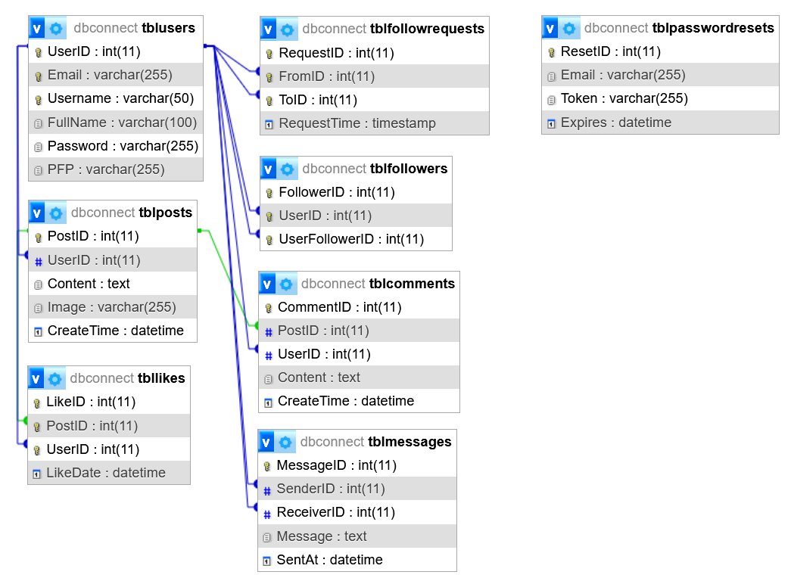

    ## Other Database Information
    - Media (images, gifs videos) that can be uploaded, are stored as relative file names
        - content/posts --> Posted Media
        - content/profiles --> User profile photos + default.jpg
    - The images are not stored within the database in order to focus on efficiency & database security
    - Passwords are hashed before storage, using the standard hashing algorithm SHA256
    - MySQL database storage, connection using mysqli in PHP, management in phpmyadmin
    - All relational tables have been created with the constraints of "ON DELETE CASCADE"

# How It Works

## Landing Page
- Redirects users to the Log In page or Dashboard relative to their session ID
- Creates a session, checking if a connection has a user ID
- If the user has one, it means that they are logged in and must be redirected to the Dashboard
- If not, the user must be redirected to the Log In page

## Logging In
- The user must enter the following VALID information:
    - Email
    - Password
- Comparisons are made on whether the email exists, and then if the password matches the password token stored in the database with respect to that email.
- Once the correct information is entered, the user will be redirected to the dashboard.
- If the user does not enter a valid password and email match, they will not be able to log in

## Creating an Account
- The user must enter the following VALID information:
    - Email
    - Full Name (not validated on any naming metric)
    - Username
    - Password
    - Repeated password
- Once the user has successfully filled in valid entries, comparisons are made on the email and usernames, to check that accounts dont exist already with the entered information.
- Passwords are checked to ensure they are the same.
- the users information is processed and they are redirected to a success page.
- Here they are able to upload an optional profile photo.
- Once they continue, they will be redirected to the login page and will have to enter their new login credentials.

## Resetting a Forgotten Password
- There is a link included in the login page to reset a users account password.
- They will be prompted with entering their email address of their existing account.
- Checks are done to ensure the account exists.
- They will then be redirected to a page telling them that an email has been sent including a link to reset their password, this is done with tokens.
- As the project is not hosted and limited to the localhost, a link is provided for testing purposes to access that link that allows the user to reset their password.
- In this page, the user must enter a new password and repeat it to ensure it is correctly typed.
- After that the password is updated and the user is directed to the login page.

## Dashboard
- The dashboard has 4 main components:
    - Heading --> A button link that will always take the user back to the dashboard
    - Access Bar --> Buttons for navigation of features
        - Profile Image to go to profile
        - Message Button to see messages and initiate conversations
        - Post button (+ icon) that highlights the post area and scrolls to it
        - Search button to search for users via their username
        - Settings button to change account options
    - Recents & Following Tab --> switches between recent posts from everyone and recent posts from a users friends
    - Create Post Area --> The area where a user uploads text and/or media and submit
    - Posts Area --> Where the newest specific posts are loaded
        - Users can view media (images, gifs and videos)
        - Like the posts
        - Upload a comment to a specific post

## Profile
- Loads either the users account or searched user accounts
- Logged In User Account
    - Profile image, username and a link to their friends list and follow requests displayed
    - A button to go to the account settings and a home button for the dashboard
    - Create Post Area for creating new posts
    - A list of all the users own posts with access to likes and comments
- Viewing Another Users Account
    - Profile image, username and the number of friends the user has displayed
    - A button for either requesting to follow, unfollow or cancel follow request, and a home button
    - A list of all the users posts with access to liking and commenting

## Messages
- The area in which a user can initiate and have conversations with other users
- Computer and mobile view
- A button that takes the user to their own friends and follow requests
- A conversation tab for showing active conversations and a search bar for searching and initiating conversations
- Once the user has clicked on a conversation, the messages are loaded and the user is able to send text

## Search
- The area in which a user can search for other accounts via their username
- Accounts are shown as previews and they can be clicked on to view the full account page

## Settings/Options
- The area in which a user can change their own account settings
- They can change their username and profile image
- They are also able to log out here or delete their account

# Conclusion
The whole system relies purely on the existence of the database (dbconnect) in XAMPP. I have done my own tests to ensure everything works as expected and to my own ability. I relied on frontend styling with Google Chrome and within a mobile view aswell. In the ZIP folder for my submission i will include htdocs, which will be placed in your XAMPP htdocs folder, and the sql file. 

# Preview (For GitHub)
### Login
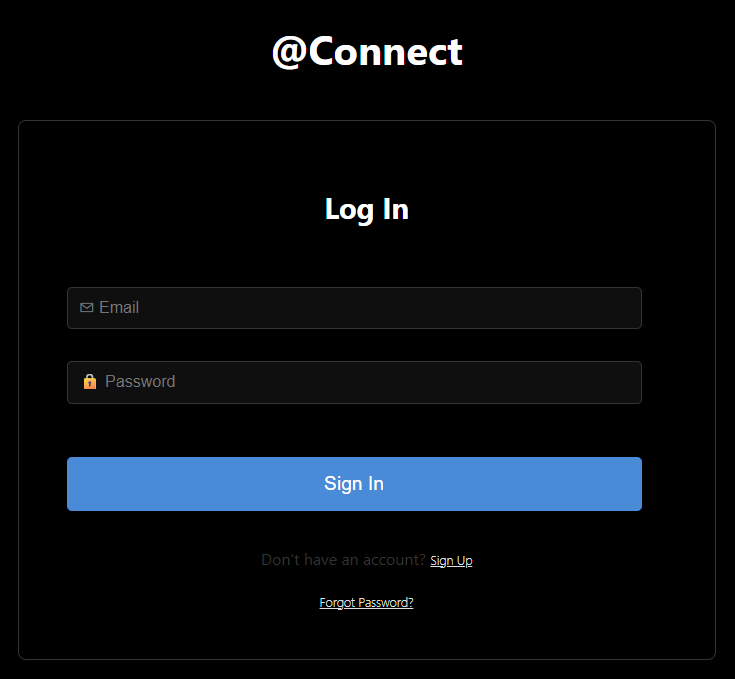
### Sign Up
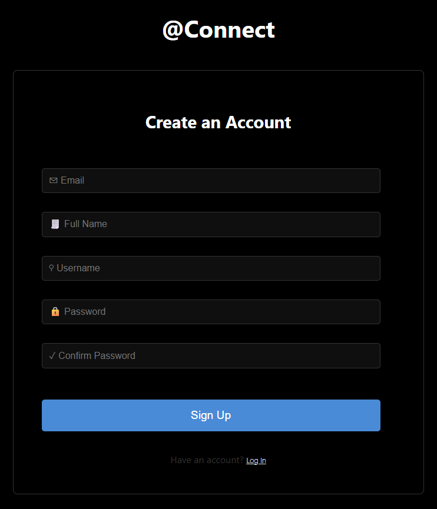
### Forgotten Passwords
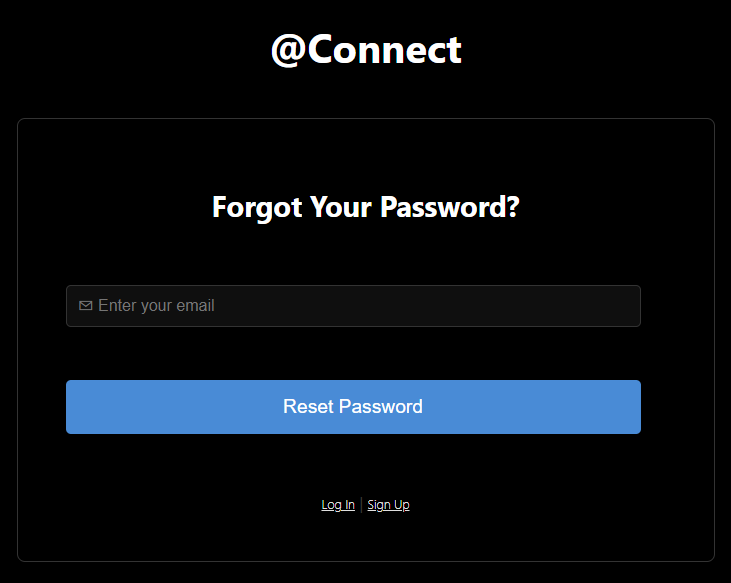
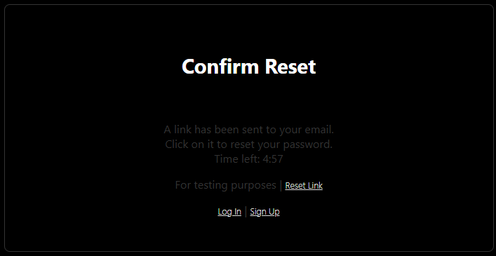
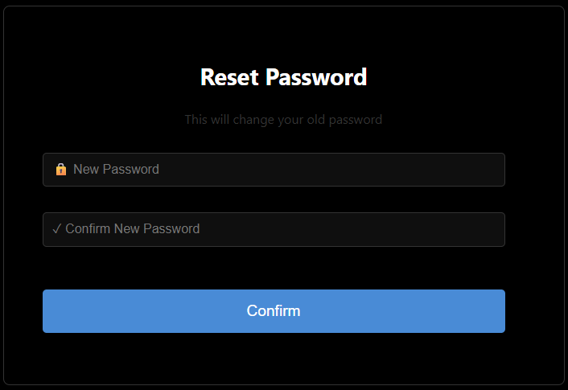
### Dashboard - Recents
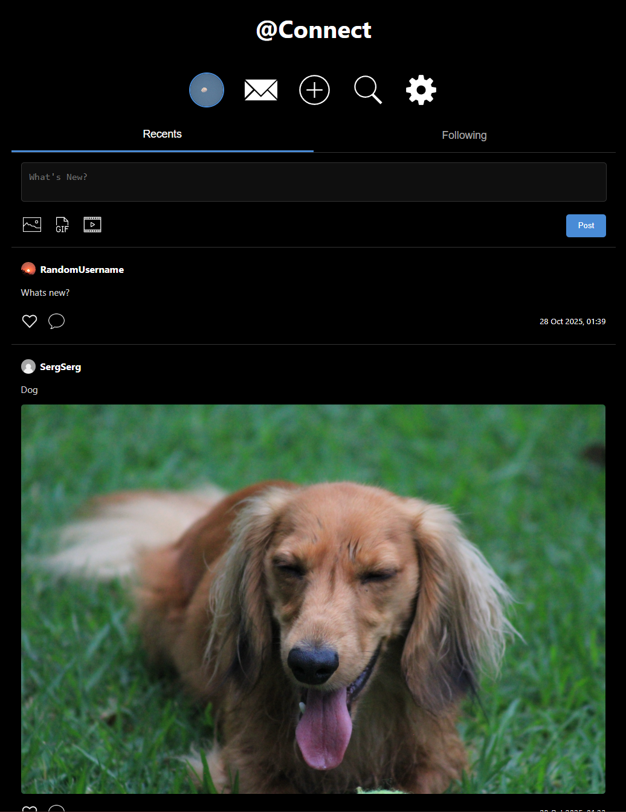
### Dashboard - Comments
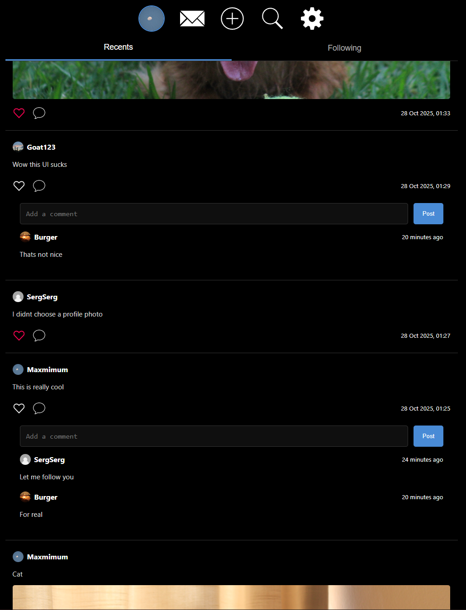
### Dashboard - Following
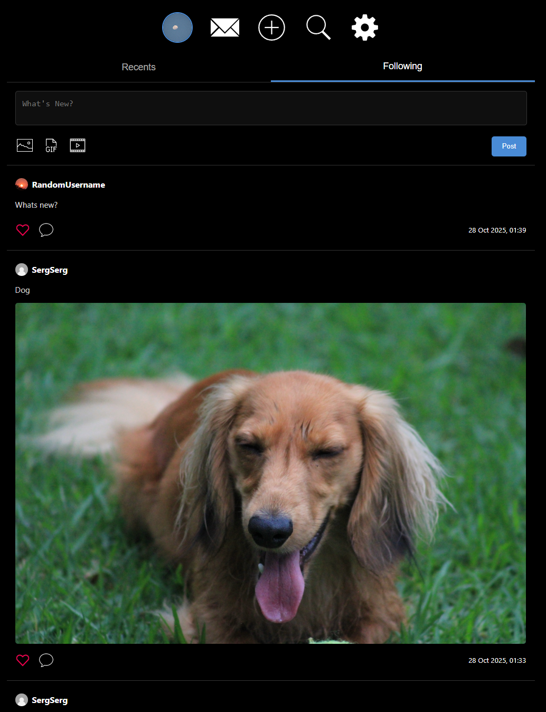
### Account
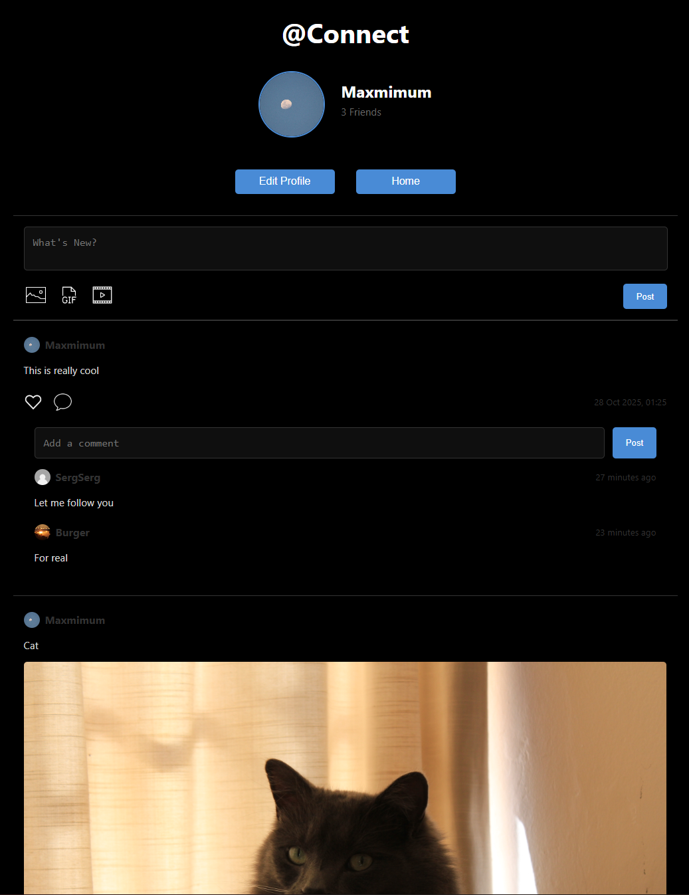
### Other Users Account
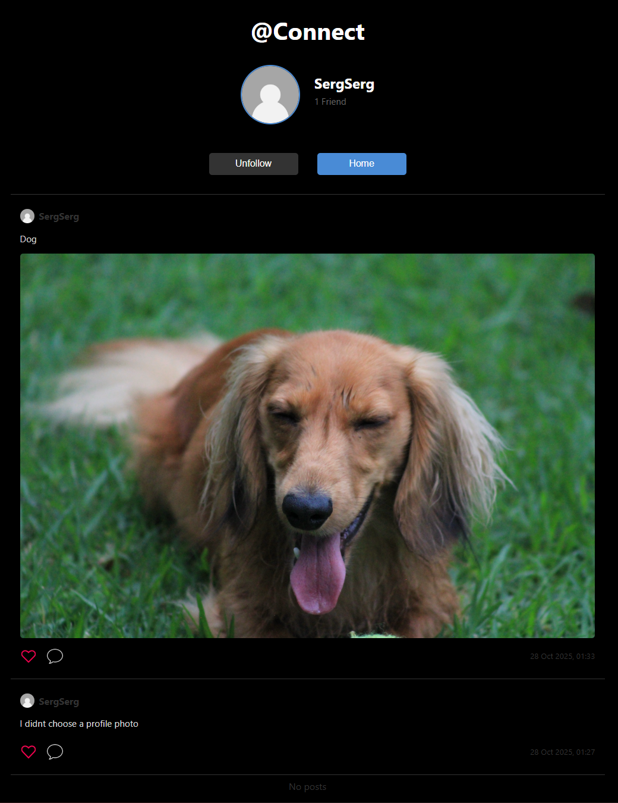
### Messages
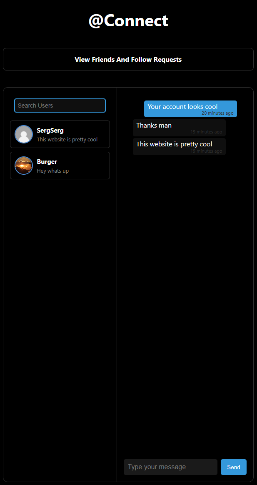
### Following
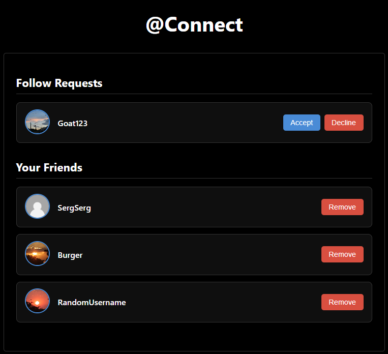
### Search
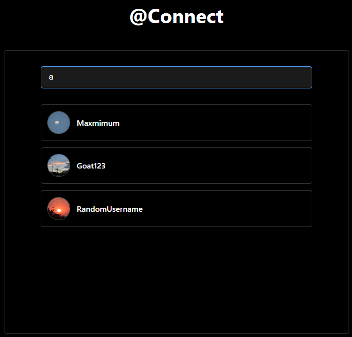
### Settings
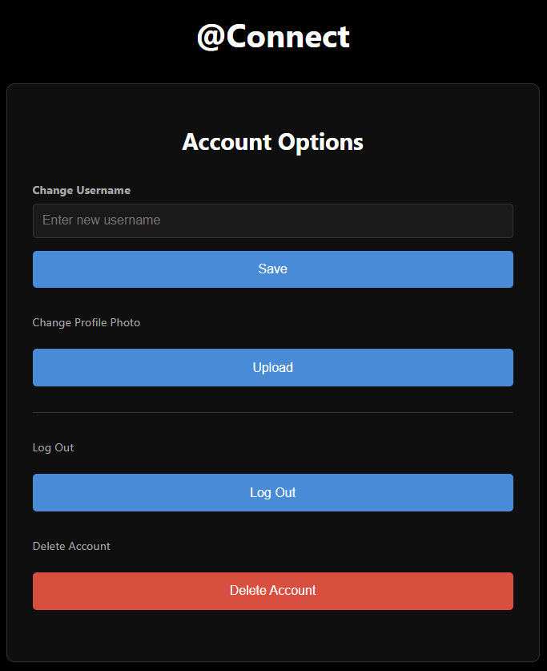
### Initiating a conversation
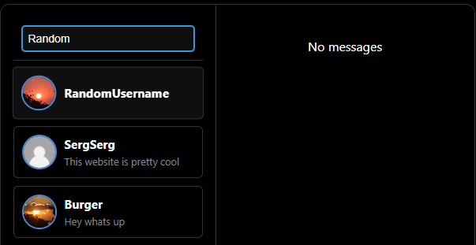
### Mobile Examples
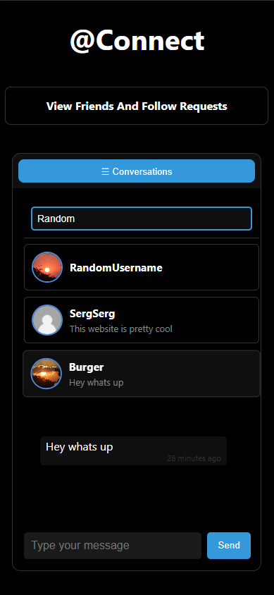
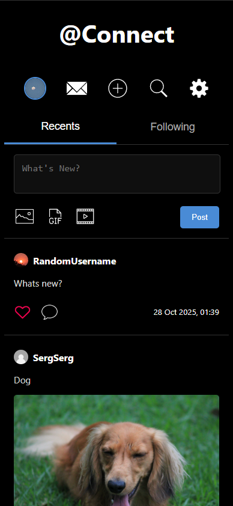